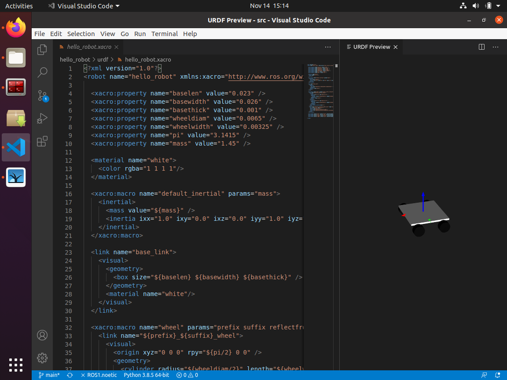
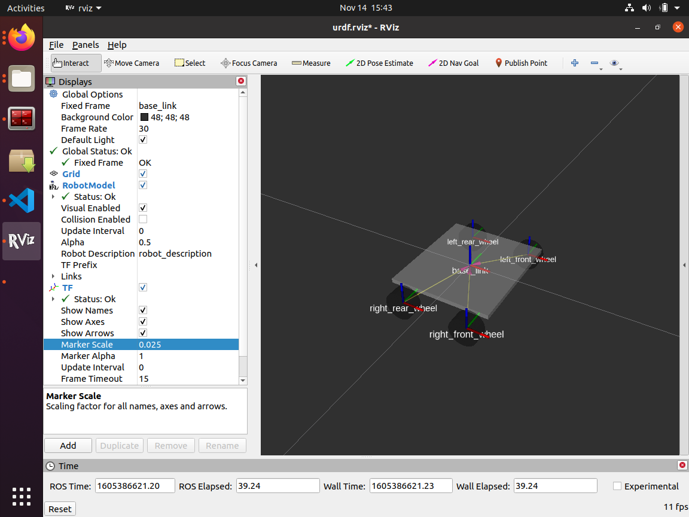
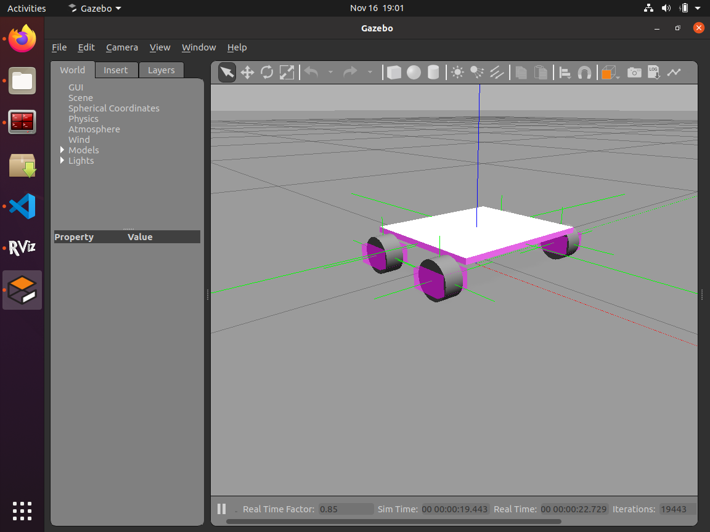
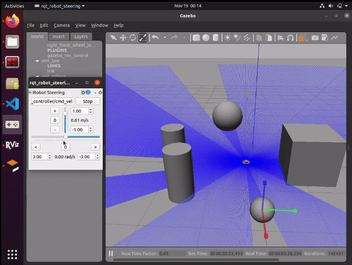
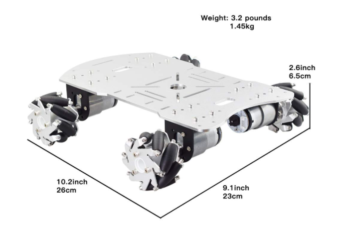

# hello_robot Xacro and URDF #

This repository hosts the source code for the ROS < hello_robot > package which builds the model for my first robot.

Below is the picture of the base that I will be building the URDF for.  The goals of this repository are:
- roughly model the base and attach ROS controllers to the wheel so it can be driven in gazebo
- add a laser sensor to the simulation 

The actual robot will have a RPLIDAR A1 laser senor and mecancum wheels.

## Key concepts covered ##
- creating a URDF from scratch
- using Xacro to clean up the URDF and parameterize the creation of the robot
- importing URDF into Gazebo
- moving the robot in Gazebo
- adding a laser sensor to the model
- visualizing the laser scanner in RViz
- configuring Gazebo controls
- configuring Navigation and SLAM packages
- tuning parameters
- building physical robot

### Usage ###
#### View hello_robot in RVIZ ####
- `roslaunch hello_robot_description hello_robot_rviz.launch`
#### View & drive hello_robot in Gazebo ####
- `roslaunch hello_robot_gazebo hello_robot_world.launch`
#### SLAM GMapping with hello_robot ####
- in one terminal `roslaunch hello_robot_gazebo hello_robot_world.launch`
- in 2nd terminat `roslaunch hello_robot_slam hello_robot_slam.launch`
- save map using `rosrun map_server map_saver -f nameOfMap
#### Navigation with hello_robot ####
- in one terminal `roslaunch hello_robot_gazebo hello_robot_world.launch`
- in 2nd terminal `roslaunch hello_robot_navigation hello_robot_navigation.launch`

Very quick video showing the SLAM and Navigation working.

### Simulation ###

### Physical Robot ###

